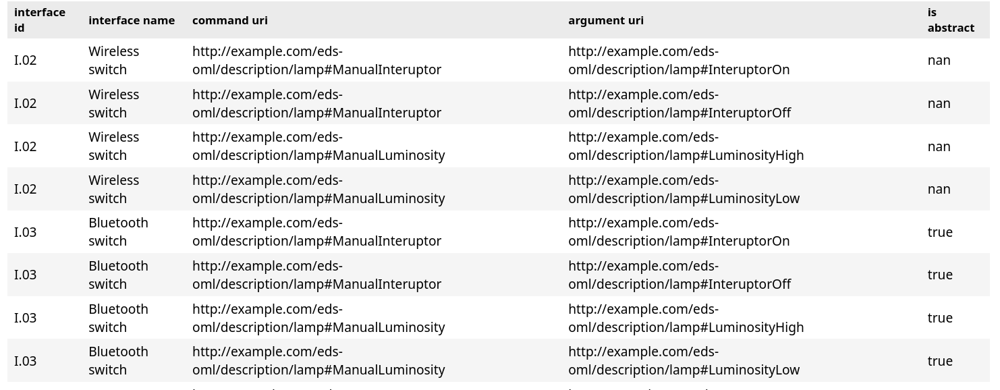

# Documentation - Explaination

## Abstract

The "Electronic Data Sheets (EDS) for Space Systems" project is a pioneering initiative aiming to revolutionize the documentation and interfacing standards within the space industry. 
Traditionally, space missions involve the integration of multifaceted subsystems, each necessitating precise, yet diverse, documentation. This heterogeneity in documentation standards not only complicates the design and integration process but also heightens the risk of human error, potentially jeopardizing mission success.

This project introduces the standardization of EDS, transitioning from varied, often over-complicated documentation to a unified, machine-readable format. EDS encapsulate vital details such as electrical connections, data interfaces, and operational protocols, ensuring unambiguous, standardized, and easily interpretable data across different systems. 
This standardization is anticipated to significantly reduce interpretational errors, streamline system integration processes, and facilitate the automatic generation of engineering artifacts, thereby accelerating the mission design lifecycle.

Two parallel approaches underpin the project: enhancing the existing digital format within the Spacecraft Onboard Interface Services (SOIS) architecture and leveraging the Space Avionics Open Interface Architecture (SAVOIR) for a comprehensive European EDS format. This interoperability is expected to extend throughout the entire mission lifecycle, simplifying tasks like validation and interface compatibility checks.

The project's culmination will see the integration of EDS into real-life space applications, marking a significant stride in space systems engineering.

Our work is to create a Domain Specific Model Language to challenge this problem.

## Challenges

Model-Driven Engineering (MDE) stands at the forefront of addressing complex challenges in the modeling and generation of domain-specific models, particularly in sophisticated fields like space systems engineering. 
The introduction of Electronic Data Sheets (EDS) within this domain underscores a critical need for a standardized, unambiguous system representation that can be easily interpreted, shared, and implemented across various platforms and among diverse stakeholders.

One of the primary challenges in this domain is the sheer complexity and heterogeneity of systems involved in space missions. Traditional engineering approaches often fall short in managing this complexity, leading to inefficiencies, increased error margins, and escalated costs. MDE addresses this by abstracting the complexity through high-level models that are simpler to understand, manipulate, and communicate. These models, representing the system's functionalities and behaviors in a standardized manner, are paramount in EDS, ensuring consistency in documentation and interpretation.

Moreover, the space industry's traditional documentation is fraught with risks of misinterpretation, inconsistencies, and difficulty in validation. MDE's emphasis on using formalized and standardized models mitigates these issues. With EDS, MDE facilitates the creation of precise, machine-readable, and verifiable specifications for system components. These specifications can be consistently used across various stages of system design, implementation, and operation, reducing discrepancies and enhancing system integrity.

Another significant challenge is the manual generation of system artifacts, which is time-consuming and prone to errors. MDE excels by enabling the automatic generation of these artifacts from the established models, ensuring accuracy, consistency, and significant time savings. In the context of EDS, this capability is invaluable. By defining system interfaces and behaviors through EDS, engineers can automatically generate code, configuration files, and documentation, thereby accelerating the development cycle and reducing human error.

Furthermore, system evolution and scalability pose substantial challenges, especially in an industry where technology is ever-evolving. MDE supports scalability and adaptability through its model abstraction philosophy. As systems evolve, the underlying models in EDS can be easily updated, and corresponding system artifacts can be regenerated, ensuring the system remains up-to-date with minimal manual intervention.

Finally, the integration of systems from different vendors is a common hurdle due to varied interface and interaction specifications. EDS, developed through MDE principles, act as a common language, ensuring that components from different vendors are interoperable. This standardization is crucial for the successful integration and operation of space systems, reducing integration issues that arise from incompatible components.

In conclusion, MDE's application in the development and utilization of EDS addresses several challenges inherent in space systems engineering. By providing a standardized, scalable, and efficient approach to system specification and implementation, MDE significantly enhances the reliability, consistency, and interoperability of these advanced systems.

## Previous work

A significant precursor in the field was the development of the Spacecraft Onboard Interface Services (SOIS) architecture under the Consultative Committee for Space Data Systems (CCSDS). SOIS set out to standardize data handling and communications for space systems, and its EDS standard marked a pivotal shift towards machine-readable specifications. This initiative highlighted the potential for reducing human error and streamlining system integration by adopting a standardized approach to documenting system components and interfaces.

Concurrently, the Space Avionics Open Interface Architecture (SAVOIR) initiative sought to federate the development of European space systems. SAVOIR's aim to establish common specifications and interfaces resonated with the goals of EDS, emphasizing the need for a unified language in space systems engineering. The convergence of these initiatives underscored the industry's growing consensus on the importance of standardization for ensuring system interoperability and reducing complexity.

The application of the Eclipse Modeling Framework (EMF) in EDS also stands out. Leveraging EMF's capabilities, researchers experimented with generating ecore metamodels from EDS schemas. This work demonstrated the feasibility of using MDE tools to create, visualize, and validate EDS, setting a precedent for the current project's ambitions. It also highlighted the potential for automating the generation of engineering artifacts from EDS, a capability that is central to the current project.

NASA's integration of EDS into its core Flight System (cFS) software marked another milestone. This integration showcased the practical benefits of EDS in real-world space systems, highlighting how EDS can enhance system reliability, facilitate component interoperability, and streamline the system development lifecycle. The cFS initiative provided valuable insights into the challenges and best practices for integrating EDS into complex systems, informing subsequent efforts in this domain.

Furthermore, the TASTE toolset, a model-driven development environment for real-time systems, has been instrumental in bridging the gap between EDS and system implementation. By enabling the automatic generation of system artifacts from EDS models, TASTE has demonstrated the efficiency gains and error reduction that can be achieved through MDE principles.

These previous works collectively highlight the industry's trajectory towards standardized, model-driven approaches to space systems engineering. They reflect the growing recognition of the benefits of EDS and MDE, from enhancing system interoperability and reliability to reducing development time and costs. As the current project builds on these foundations, it seeks to further these benefits by broadening the application of EDS and MDE principles in the space industry.

## Methodology

## Abstract Syntax

## Concret Syntax

## Validation rules

## Transformation

In our EDS project, we employ transformation techniques focusing on translating structured data models into readable and informative formats. 
This transformation process is pivotal in the realm of DSML, as it bridges the gap between complex data models and practical, user-friendly representations.
So, we developed a Model-to-Text transformation using a template-based approach. This is implemented in a [Jupyter notebook](./oml-eds/src/ipynb/index.ipynb) that combines static parts explaining the organization of the Electronic Data Sheets (EDS) and dynamic Python segments. These dynamic parts utilize Python with the pandas library and PlantUML, processing JSON files generated in response to SPARQL queries.

Additionally, we established a CI/CD pipeline using GitHub Actions. This pipeline automates the building of our Gradle project, mapping to OSL, responding to OWL queries, and constructing the Jupyter notebook for display on a GitHub page.

Our approach revolves around several key transformations:

### Transformation 1 : Device & Metadata

This [Device-Metadata](oml-eds/src/sparql/device_metadata.sparql) transformation leverages SPARQL query to fetch and associate devices, represented by their id and canonical name, with their metadata, also represented by their id and canonical name. 
The objective is to present a clear view of devices and their metadata attributes within the EDS ecosystem. We utilize tree graphs for visualization, ensuring each device and its metadata are distinctly represented, facilitating easy comprehension and analysis. Each node, is represented by a concatennation of their id and name for more simplicity.

### Tranformation 2 : Component set

This [Component Set](oml-eds/src/sparql/componentSet.sparql) query extracts the identifiers and names of component sets and their respective components, highlighting the structure and organization of components within the system. 
Here, the focus is on illustrating the organization of components within their respective sets. 
To do this, we generate an object diagram. 
This diagram serves as a visual guide to the arrangement and grouping of components, highlighting the good structure of our components.

### Tranformation 3 : Components & interfaces
This [Components-Interfaces](./oml-eds/src/sparql/component_interface.sparql) offers insights into the relationships between components and their interfaces.
This transformation is crucial for understanding the interaction and interdependencies of various system elements. The visualization aids in dissecting the complex network of components and interfaces, making it easier to grasp their roles and connections.
A component diagram visualizes these networks, labeling relationships as required, provided, or declared interfaces.

### Transforamtion 4 : Interaface & co

[Interface](oml-eds/src/sparql/interfaces.sparql) query extracts detailed information about interfaces, including their associated commands, generic types, and sets. It reveals the ID and name of each interface, command, and component, providing a comprehensive overview of the interface architecture. This 
The SPARQL query provided a detailed breakdown of each interface's characteristics and its role within the system.
Finaly, these data are displayed in a tabular format for clarity

Each of these transformations is designed to make the intricate data of EDS more accessible and understandable, catering to both technical and non-technical stakeholders. This approach not only aids in effective data interpretation but also enhances the usability of DSML in practical scenarios.